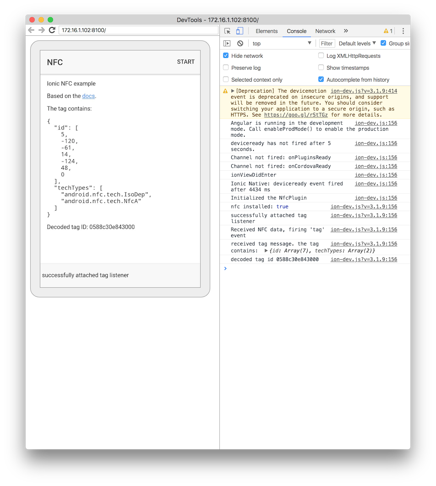

# ionic-nfc-example

📲🤖

### Why?
Just trying to make it work somehow for a simple app using Ionic Native NFC (against all odds).

## Installation
```bash
$ yarn install:clean
```

## Usage
- Connect your device and enable USB debugging.
- `yarn start`.
- Launch `chrome://inspect/#devices` to start the remote debugging.

## Troubleshooting
After went through highs and lows, centaurs, cyclops, hydras, and unicorns, I managed to make it work eventually. 

https://github.com/ionic-team/ionic-native/issues/2538

Just keep going. You'll get there.



## Author
Glenn Dwiyatcita ([@dwiyatci](http://tiny.cc/dwiyatci))

## License
MIT.
